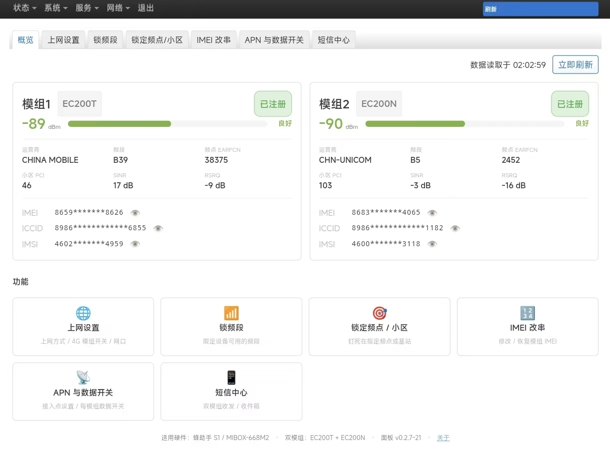

# FZS Panel · luci-app-fzs

> **A Chinese-language cellular maintenance panel for the "FengZhuShou S1" (MIBOX-668M2), running on community OpenWrt firmware.**
> Dual-modem status · Band lock · EARFCN/PCI lock · IMEI change · APN & data switches · Dual-modem SMS with auto-forwarding.
> Ships as a **single .ipk** — upload it in the browser to install, **no re-flashing required**.

**语言 / Language：** [简体中文](README.md) · **English**

**Scope & keywords** (for search):
`FengZhuShou S1` / `MIBOX-668M2` / `MT7628` 4G CPE, `Quectel EC200T` / `EC200N`, `ASR1802`,
`AT*BAND` (band lock), `AT*CELL` (EARFCN / PCI / cell lock), `IMEI` change,
`OpenWrt 22.03`, `LuCI`, SMS forwarding (Telegram / DingTalk / WeCom / Feishu / webhook),
`PDU` SMS, dual-modem SMS, OTP forwarding.

> ⚠️ **Read the [Disclaimer](#disclaimer) before use.** This project involves changing the IMEI, which is
> legally restricted in most countries/regions. Use it only on hardware you legally own.

> 📦 **Download the panel (.ipk)**: [Releases page](../../releases/latest) → pick the latest release →
> download the `luci-app-fzs_*.ipk` asset.

> 💚 **This project is completely free and open source. No paid content whatsoever.**
> We do not sell devices, services, "pro" versions, donations or promotions.
> If you **paid money** for it, **you have been scammed** — demand a refund immediately,
> and feel free to report the seller in the issue tracker. See [About Free](#about-free).

---

**Panel overview** (dual-modem status + all feature entries):



## What is this

The community OpenWrt firmware turns the MIBOX-668M2 into a real OpenWrt router
(dual-modem RNDIS + mwan3 + LuCI) — but everything cellular is SSH-only; LuCI shows nothing.

This panel turns those capabilities into a **graphical interface**, so users who never touch a
command line can:

- See **both modems** at a glance: signal, carrier, band, cell;
- Lock bands / EARFCN / PCI;
- Send and receive SMS, and auto-forward messages to a phone app or group bot;
- Read/change the IMEI, set the APN, toggle 4G data.

> The firmware itself is built by a community developer (see [Acknowledgements](#acknowledgements));
> this project only delivers the panel (the .ipk).

---

## Supported device & requirements

| Item | Requirement |
|---|---|
| Device | **FengZhuShou S1 / MIBOX-668M2** (MT7628 + Quectel EC200T + EC200N dual modem) |
| System | **OpenWrt 22.03 or later** (client-side JS LuCI) |
| Dependencies | None beyond `luci-base` / `rpcd` / standard `libc` |

**Two honest notes:**

1. **22.03 or higher is required.** The panel uses the LuCI client-side JS architecture;
   21.02 and earlier (Lua-based LuCI) will not load it.
2. The **Network Settings** page relies on the firmware's built-in platform scripts
   (`/etc/config/mifi` etc.). On other firmware that page may not work — **everything else is
   unaffected**, because band/cell/IMEI/SMS all talk to the modems directly.

> Tested **only on OpenWrt 22.03.7**. 23.05 / 24.10 should work (only stable LuCI APIs are used)
> but have not been verified on hardware.

---

## ⚠️ SMS: read this first

| SIM inserted in | SMS domain | Measured behaviour |
|---|---|---|
| **EC200N slot (modem 2)** | **IMS** | **Received in seconds, consistent across all carriers** |
| **EC200T slot (modem 1)** | **CS** | 15–30 s; **some China Unicom and China Telecom cards receive nothing at all** |

⇒ **For fast, reliable SMS, put your SIM in the EC200N slot.**

The reason is a hardware/firmware difference: the EC200T firmware has no VoLTE/IMS
(`AT+QCFG="ims"` returns `+CME ERROR: 4`), so SMS can only use the CS domain — and CS-domain
SMS has been deprecated on some carrier networks. No software can fix this.
(Technical details: [SMS Implementation Guide](短信实现详解.md).)

---

## Before you start: which firmware are you on?

⚠️ **This panel runs on community OpenWrt firmware.** If you are currently on the **stock vendor
firmware** (with cloud control), or on the sister project **fzs1-decloud** (vendor firmware +
de-clouded toolbox), **you must change the underlying firmware first**, then come back to
[Installation](#installation-3-steps-all-in-the-browser):

| You are currently on | What to do |
|---|---|
| **Stock vendor firmware** | Flash the community OpenWrt firmware first (below), then go to [Installation](#installation-3-steps-all-in-the-browser) |
| **Sister project fzs1-decloud** (vendor firmware + toolbox) | Same — flashing replaces the toolbox. **This panel covers all of its features** (IMEI / band lock / cell lock / WAN priority / status panel) and adds an SMS centre |
| **Already on community OpenWrt** | Go straight to [Installation](#installation-3-steps-all-in-the-browser) |

### How to switch to the community OpenWrt firmware

**Where to get the firmware**: the community OpenWrt firmware for this device is built and
published by **羁穗** (JiSui, on CoolApk) — **get the firmware from his release thread**.

**How to flash** (the thread doesn't spell this out, so here it is):

> 🔑 **Stock-firmware users, start here: can't log into the :8888 admin?**
> The stock 8888 (LuCI) password is factory-set and nobody knows it, so clear it first:
> 1. Open **`http://192.168.1.1/SysCommand.htm`** in your browser (the stock :80 "system command
>    line"; username/password are both `admin`);
> 2. Run one command: **`passwd -d root`** (deletes the root password);
> 3. Back at **`http://192.168.1.1:8888`**, log in as `root` with an **empty password**.
>
> (Already on fzs1-decloud? The toolbox has an "admin password" setting — set one and log in.
> This step is not needed.)

1. Open the device's **OpenWrt admin (LuCI)** in your browser;
2. Left menu → **System → Backup / Flash Firmware**;
3. In the lower half of the page, **"Flash new firmware image"** → click "choose file" and pick
   the firmware you downloaded;
4. ⚠️⚠️ **Do NOT tick "Keep settings"** — remember this one:
   vendor and community firmware configurations are **incompatible**; keeping them can leave the
   device **failing to boot after flashing** (a genuinely-learned lesson);
5. Click "Flash image…" → confirm → wait for the automatic reboot (about 1–2 minutes; do not
   cut power).

**After flashing, check:**

- The LuCI admin opens (`http://192.168.1.1`);
- The panel's Overview page (or `mifi-at ports`) shows **both modems** detected.

> 💡 One rule to remember: **when flashing across systems (vendor ↔ community), never keep
> settings** — the config formats differ, and keeping them breaks the boot. The same applies to
> [Going back to the stock firmware](#going-back-to-the-stock-firmware) later in this document.

⚠️ **Three warnings**:

1. **Flashing wipes the current system** — vendor cloud control and any toolbox are gone. Decide
   before you act;
2. **Stock-firmware users should back up first** (see
   [Going back to the stock firmware](#going-back-to-the-stock-firmware));
3. **If you regret it**, we provide a restore image — same link as above.

---

## Installation (3 steps, all in the browser)

1. Download the latest **`luci-app-fzs_<version>_all.ipk`** from the
   **[Releases page](../../releases/latest)**
   (direct link: `https://github.com/zzt718/fzs1-panel/releases/latest`);
2. Open the LuCI admin → **System → Software** → **"Upload Package…"** at the top → pick the
   .ipk → click **Install**;
3. ⚠️ **After installing, log out and log back in** — LuCI builds its menu **at login time**, so
   the new menu **will not appear until you re-login** (a very common "it didn't install!" false
   alarm). After re-login, **"FZS Panel"** appears under the **Services** group.

> Command line works too: `opkg install /tmp/luci-app-fzs_xxx_all.ipk` (zero dependencies,
> installs offline).

### Uninstall

**System → Software → find `luci-app-fzs` → Remove**.
SMS data lives in `/etc/fzs-sms/` and config in `/etc/config/fzs-sms`; **uninstall does not
delete them** (remove those two manually if you want a full wipe).

### Does upgrading lose data? — No

Upgrades replace the program only; SMS and settings are preserved:

| | Stored at | On upgrade |
|---|---|---|
| SMS (inbox / sent) | `/etc/fzs-sms/` (not part of the package) | Untouched |
| Forwarding tokens, channel config | `/etc/config/fzs-sms` (declared as conffile) | Your version kept |
| Program | `/usr/libexec/`, page files | Replaced by the new version |

---

## Features

> Under the left menu "FZS Panel": **Overview → Network Settings → Band Lock → Cell Lock →
> IMEI → APN & Data → SMS Centre**.

### Overview

One card per modem: model, IMEI / ICCID / IMSI (masked by default, eye icon to reveal),
RSRP bar with quality label, carrier, band + EARFCN + PCI, SINR / RSRQ, registration status.
Auto-refresh every 30 s, or manual refresh. The page bottom has entries to every feature,
plus the supported hardware, the panel version and an "About" dialog (licence /
acknowledgements / disclaimer).

### Network Settings

- **WAN mode** (takes effect in ~40 s): 4G only / Wired only / Wired first / Load balance (dual SIM);
- **4G modem switch** (requires reboot): turning a modem off stops its data only —
  **SMS, band lock and IMEI are unaffected**;
- **Ethernet ports**: pick the WAN port by clicking a drawing of the real back panel
  (silkscreen LAN2 / LAN1 / LAN0).

> Switching reorders mwan3 multi-WAN priorities without rebooting; a few seconds of network
> hiccup is normal.

### Band Lock

Tick FDD / TDD bands → Apply → the modem re-registers and data dialling resumes automatically.

| FDD-LTE | TDD-LTE |
|---|---|
| B1 / B3 / B5 / B8 | B34 / B38 / B39 / B40 / B41 |

"Restore factory bands" is always available. Band locking only limits **which bands are
allowed** — the network decides where the modem camps (China Mobile cards prefer TDD). To pin
an exact frequency, use the next page.

### Cell Lock (EARFCN / PCI)

"Lock current cell" detects the current EARFCN and PCI and locks them; you can also enter the
EARFCN manually (band is derived automatically) with an optional PCI. If the modem fails to
register within 75 s, the lock is released automatically and dialling resumes.

### IMEI

Read / back up / restore / write. A 14-digit input gets its Luhn check digit computed; a wrong
15-digit check digit produces a correction suggestion. Writing requires a second confirmation.
**Changing the IMEI is legally restricted — only on devices you legally own, with lawful values.**

### APN & Data

Each modem can have its APN set (auto / carrier presets / custom), plus a per-modem data switch.

### SMS Centre

- **Dual-modem send & receive** (each modem has its own inbox; shown merged in one UI);
- **Concatenated SMS** reassembly (UDH segments);
- **Pure PDU** send/receive — zero stray characters, full fidelity for Chinese and English;
- Inbox / Sent with pagination (10 per page); data persists in `/etc/fzs-sms/` and survives upgrades;
- Delete single / clear all; the last 100 sent messages are kept;
- **Auto-forwarding to 7 channels**, pushed immediately on receipt, 3 automatic retries and a
  failure queue;
- Forwarding can be enabled **per modem**.

**Channels:**

| Channel | What you enter |
|---|---|
| Telegram | Bot Token + Chat ID |
| DingTalk | Group-bot webhook (signed supported) |
| WeCom (Enterprise WeChat) | Group-bot webhook |
| Feishu (Lark) | Group-bot webhook |
| PushPlus | token |
| Bark | Push URL |
| Generic webhook | Custom URL / method / headers / body |

**Notes:**

- Forwarding is triggered by a background daemon — the page does not need to stay open;
- If a channel's helper package is missing, the page shows a one-click install hint.

---

## Implementation notes

> Full command list, PDU structure, measured data and code notes:
> **[SMS Implementation Guide](短信实现详解.md)** (Chinese). This section is the short version.

**Background**: a third-party SMS-forwarding firmware already exists for this device
(self-built IMS stack on the EC200T slot, AT polling on the EC200N slot). This project's SMS
uses an **AT + PDU polling** approach; below are the main problems on that path and how they
are handled.

### 1. PDU only, never text mode

The modem firmware (`EC200TCNHAR02A01M16_BETA0520_PS`) corrupts Chinese SMS in text mode —
the modem acknowledges the submit (`+CMGS`) but the carrier receives mojibake. So this project
**never uses text mode**: sending and receiving are both PDU (`AT+CMGF=0`), encoded/decoded by
the panel itself.

One receive session:

```
AT                    → OK
ATE0                  → OK
AT+CMGF=0             → OK
AT+CPMS="ME","ME","ME" → +CPMS: <used>,<total>,...
AT+CMGL=4             → +CMGL: <idx>,<stat>,<len>\r\n<PDU hex>
```

Sending: `AT+CMGS=<TPDU byte count>` → wait for `>` → feed PDU → wait for `+CMGS: <mr>` + `OK`.
The PDU's first byte is `00` (no SMSC — use the modem default), `FO=01` (SUBMIT, relative
validity); the encoding is chosen automatically between GSM 7-bit and UCS2. The decoder
implements GSM7 packing/unpacking, UCS2, and UDH concatenated-SMS reassembly.

### 2. An integrity criterion for reading the AT port

"No output" and "incomplete output" are different things; checking only for "some output" loses
data. The criterion used here:

```sh
_want=$((2 + $#))                    # 2 = the fixed AT + ATE0 session preamble
_ans=$(printf '%s\n' "$buf" | grep -cE '^(OK|ERROR|\+CME ERROR|\+CMS ERROR)')
[ "$_ans" = "$_want" ] || retry the whole session  # must be EXACTLY equal
```

**Why "exactly" and not `≥`**: when the modem is busy, the `AT+CMGL=4` response can appear
**twice in full** (measured: `OK=13`, indices `0..6` twice). Accepting `≥` lets duplicated data
through, which scrambles UDH segment numbering so long SMS never reassemble, and receive
latency can reach minutes.

**If three retries still fail, the round is treated as failed** and empty is returned — the
messages are still in the modem and will be read next round. Nothing is lost, and no
possibly-duplicated data ever enters the store.

### 3. Timeouts and "modem busy"

- Normal modem response time is **1–9 ms**, so the per-command timeout is **800 ms**
  (~100× margin);
- **If the very first `AT` warm-up times out, the whole round is abandoned** — the modem is
  busy and every subsequent command would time out too;
- While the EC200T is **receiving and reassembling a long SMS, its AT interface is completely
  unresponsive** (even `AT` times out). That is modem behaviour; no software can remove it.

### 4. The AT engine `fzs-atio`

The shell toolchain on the device has no sub-second capability (`read -t` only accepts whole
seconds, `sleep 0.25` actually sleeps 0.04 s, and there is no `stty` / `timeout` / `socat`),
which makes a "send one command, wait for the answer, then send the next" handshake impossible.
So the panel ships a small **AT engine written in C** (statically compiled, ~65 KB, depends on
no libraries on the device):

1. **One invocation runs one complete session** — the serial port is not reopened repeatedly;
2. **Never touches DTR/RTS** (d jitter on DTR makes some 4G modems re-enumerate);
3. Sends a command → waits for its answer (millisecond timeout) → only proceeds on
   `OK` / `ERROR` / `>`;
4. Output format is byte-identical to the old scheme, so the existing parsing needed no changes;
5. Falls back to `picocom` if the engine binary is missing, so a missing tool never breaks the
   install.

Measured on the same device:

| Operation | Old scheme (picocom + fixed sleep) | `fzs-atio` |
|---|---|---|
| Query both modems' status | 14.13 s | **0.53 s** |
| Send one SMS | 13.5 s | **1.38 s** |

Source in `src/fzs-atio/` (GPL-3.0-or-later), build script `build.sh`.

### 5. Two forwarding details

- DingTalk / Feishu / WeCom group bots require `POST + Content-Type: application/json`, but the
  device's built-in `uclient-fetch` hard-codes that header to urlencoded ⇒ GNU `wget` is used
  instead (custom headers);
- **Success must be judged from the response body** (`errcode==0` / `code==0` / `ok==true`) —
  these channels **also return HTTP 200 on failure**.

---

## Known limitations

1. **The EC200T slot is slow to receive, and some Unicom / Telecom cards receive nothing**
   (CS-domain limitation) — **prefer the EC200N slot**;
2. Chinese SMS depends on PDU mode (the modem's text mode is broken; worked around);
3. The **Network Settings** page depends on the community firmware's platform scripts; on other
   firmware that page may not work — everything else is unaffected;
4. Tested only on OpenWrt 22.03.7; 21.02 and earlier are not supported;
5. Forwarding has no dedup/throttling: the same message is never pushed twice by design, but if
   the modem re-delivers abnormally, a push may repeat.

---

## FAQ

**Q: "FZS Panel" doesn't appear in the left menu after installing?**

A: Check the firmware is ≥ 22.03 (21.02's LuCI is Lua-based and cannot load it); then reload
the page. Also make sure you logged out and back in after installing.

**Q: SMS arrives slowly, or not at all?**

A: First check which slot the SIM is in. **The EC200N slot receives in seconds**; the EC200T
slot polls the CS domain (15–30 s), and **some Unicom / Telecom cards receive nothing there**.
**If SMS doesn't arrive, move the SIM to the EC200N slot and try again.**

**Q: Forwarding doesn't arrive?**

A: ① Check the forwarding switch is ticked and the channel parameters are correct; ② test
connectivity with the "Generic webhook" channel first; ③ WeCom / DingTalk / Feishu require the
**group-bot webhook**, not a regular API.

**Q: Does it affect existing networking or other functions?**

A: No. The panel does not rewrite network config files; install to use, remove to undo. The
Network Settings page only adjusts mwan3 priorities and never reboots the device.

**Q: How do I go back to the stock firmware?**

A: See the next section.

---

## Going back to the stock firmware

Community and vendor firmware are two different systems. Going back is web-only, no command
line:

1. Download the **"restore stock firmware"** image — ⚠️ **the image itself is not in this
   repository** (vendor firmware copyright; not fit for public redistribution) — get
   `蜂助手S1-恢复原厂固件.bin` from the **group files / cloud drive**;
2. LuCI → **System → Backup/Flash Firmware** → choose file → flash;
3. A **red warning** appears (`Image metadata not present`) — **this is normal**: the system
   only allows flashing OpenWrt images by default, and flashing a vendor image requires one
   manual confirmation: **tick "Force upgrade", do NOT tick "Keep settings" → Continue**;
4. The device reboots automatically into the vendor system.

> 💡 **If you were using the sister project fzs1-decloud**: after restoring the stock firmware,
> install its de-cloud package again to return to the "vendor firmware + toolbox" state (that
> toolbox overlaps with this panel — pick one).

> Full illustrated steps (with the warning screenshot and file checksums) in
> **[如何恢复原厂固件](如何恢复原厂固件.md)** (Chinese).

---

## About free

**This project is completely free and open source. There is no paid content of any kind.**

The author does **not**:

- charge money, sell the .ipk, or sell "pre-flashed devices"
- offer "paid / pro / premium" editions — everything is here
- accept donations, ads, affiliate deals or traffic diversion
- provide paid technical support in any form

**If you paid for it**: you **have been scammed** — demand a **refund** immediately and feel
free to report the seller in this repository's **Issues**.

---

## Disclaimer

**By downloading, installing or using this project in any way, you acknowledge that you have
read and accept all of the following.**

### Scope of use

- This project is for **study/research** and **modifying your own devices** only;
- Apply it **only to hardware you legally own**;
- You **may not** use it commercially, resell it, or apply it to any device you have no right
  to modify.

### Legal risks

- **Changing the IMEI is strictly regulated in most countries/regions.** Check your local law
  and bear full legal responsibility;
- SMS forwarding sends message content to third-party services (Telegram / DingTalk etc.);
  assess the privacy implications yourself and **do not forward sensitive messages**;
- This project **does not attack or intrude on any vendor's servers**; all changes happen
  locally on the device.

### Technical risks

- Flashing and system modification can brick a device. Although this project provides multiple
  fallback paths, you must understand what each step does;
- The project is tested on **specific hardware batches and firmware versions** and is **not
  guaranteed to work on all batches or firmware versions**;
- The author is not liable for any device damage, data loss, service interruption or legal
  consequences.

### No warranty

This project is provided "as is", without warranty of any kind, express or implied. In no event
shall the author be liable for any direct, indirect, incidental, special or consequential
damages arising from the use of this project.

---

## Acknowledgements

- **羁穗** (JiSui, CoolApk) — builder of the community OpenWrt firmware for this device
- The **OpenWrt / LuCI** communities — the platform it runs on
- Sister project **[fzs1-decloud](https://github.com/zzt718/fzs1-decloud)** — vendor-firmware
  de-clouding and cellular toolbox; this project's accumulated knowledge (band lock / IMEI /
  SMS / AT) came from there
- Everyone who tested and gave feedback

---

## Changelog

> Versions track the `luci-app-fzs` .ipk version.

### v0.2.7 (2026-10-10, current)

**New "Network Settings" page; Overview "About" dialog and open-source licence**

- Network Settings page: WAN mode (4G only / wired only / wired first / load balance), 4G modem
  switches, clickable back-panel port drawing;
- Overview footer "About": supported hardware, platform requirements, licence,
  acknowledgements, disclaimer, one-click link to this repository;
- Licensed **GPL-3.0-or-later** with the full licence text included.

### v0.2.5 (2026-10-08)

**Forwarding expanded to 7 channels + per-modem filter + back to zero dependencies**

- Channels: PushPlus / Bark / generic webhook / WeCom / DingTalk / Feishu / Telegram;
- Forwarding selectable per modem; 3 retries plus a failure queue;
- The main package is **zero-dependency** again (installs offline); the page shows one-click
  install hints when a component is missing.

### v0.2.3 (2026-10-07)

**Pure-PDU sending + self-built AT engine**

- Sending and receiving unified on pure PDU; Chinese and English both intact;
- The self-built `fzs-atio` replaces picocom: dual-modem status 14.1 s → **0.53 s**, sending an
  SMS 13.5 s → **1.4 s**;
- Receive-integrity criterion tightened to "exactly = 2+N"; receive latency dropped from
  minutes to seconds.

### v0.2 (2026-10-07)

**SMS Centre first release**: dual-modem inbox, long-SMS reassembly, sending, sent history,
inbox pagination (10/page), persistence in `/etc/fzs-sms/`.

### v0.1 (2026-10-06)

**First release**: Overview + Band Lock + Cell Lock + IMEI, four pages working, zero
dependencies.

---

## Licence

Released under **GPL-3.0-or-later**; full text in [LICENSE](LICENSE).
