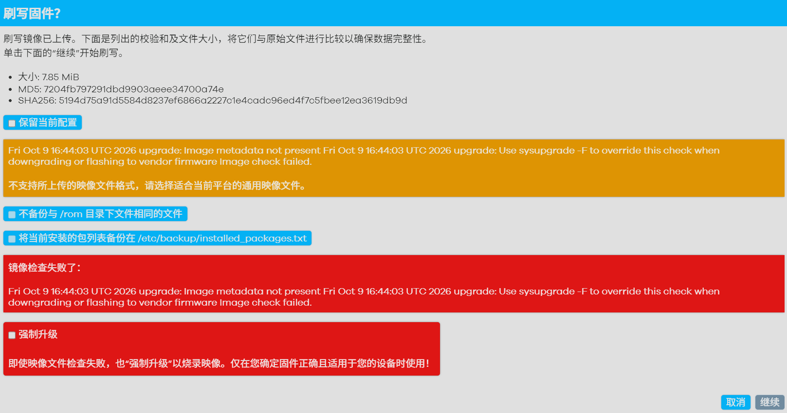

# 如何把设备恢复成原厂固件

> **适用**：刷了社区 OpenWrt 固件的 **蜂助手 S1（MIBOX-668M2）**，想回到出厂时的原厂系统。
> **需要的文件**：`蜂助手S1-恢复原厂固件.bin`（7.85 MiB，MD5 `7204fb797291dbd9903aeee34700a74e`）

---

## 一、准备

1. 把 `蜂助手S1-恢复原厂固件.bin` 下载到电脑上；
2. 用网线把电脑连到设备的 **LAN 口**（不要走 WiFi，中途断网很危险）；
3. 浏览器打开 `http://192.168.1.1/`，用 OpenWrt 后台账号登录；
4. （可选）如果你有想保留的配置，先去 **系统 → 备份/刷写固件** 页面上半部分「**备份**」导出一下。

## 二、刷写（4 步）

1. 左侧菜单 → **系统 → 备份 / 刷写固件**；
2. 页面下半部分「**刷写新固件**」→ 点「**选择文件**」→ 选中那个 `.bin`；
3. 点「**刷写固件…**」；
4. 弹出的确认页会出现**一段红色警告**（见第三节，是正常的）→
   **勾选「强制升级」** → **不要**勾「保留当前配置」→ 点「**继续**」。

## 三、⚠️ 那段红色警告是正常的，别慌

确认页会显示成**下面这样**（黄色提示 + 红色「镜像检查失败」+ 底部「强制升级」复选框）：



红框里的英文原文是：

```
Image metadata not present
Use sysupgrade -F to override this check when downgrading or flashing to vendor firmware
Image check failed.
```

**这不是文件坏了。** 原因是：你要刷的是**厂商固件**，而系统默认只允许刷 OpenWrt 的固件，
所以需要你**手动确认一次**——**勾上「强制升级」就能继续**。

（不勾就刷不了。这是系统的保护机制，不是错误。）

## 四、等待完成

- 点「继续」后出现进度条，**约 1~2 分钟**，设备会自动重启；
- **过程中绝对不要断电、不要拔网线**；
- 重启后打开 `http://192.168.1.1/`，看到**厂商的登录页面**（不是 OpenWrt 界面）就成功了。

## 五、常见问题

**Q：刷完还想装工具箱 / 去云控包怎么办？**
A：回到厂商系统后，按它原本的安装方式再装一遍即可。

**Q：这个文件干净吗？会不会带上别人家的信息？**
A：**干净**。里面**不含任何人的配置、短信、密码**——刷完是**出厂状态**。

**Q：刷完我又想回到社区 OpenWrt 呢？**
A：按社区固件原本的刷入教程再刷一次即可（它走的是同一套「备份/刷写固件」页面，且**不需要**勾强制升级）。

**Q：上传时提示文件名有问题？**
A：个别浏览器对中文文件名兼容不好，把文件重命名成英文（例如 `factory.bin`）再传即可，内容不受影响。

**Q：刷到一半失败了怎么办？**
A：重新刷一次；如果设备起不来，需要用串口/TFTP 方式救援（可到群里求助）。

---

## 文件信息（请核对，防下到损坏的）

| 项 | 值 |
|---|---|
| 文件名 | `蜂助手S1-恢复原厂固件.bin` |
| 大小 | 8,229,659 字节（7.85 MiB） |
| MD5 | `7204fb797291dbd9903aeee34700a74e` |
| SHA256 | `5194d75a91d5584d8237ef6866a2227c1e4cadc96ed4f7c5fbee12ea3619db9d` |

> 校验方法：Windows 上在文件所在文件夹按住 Shift 右键 →「在此处打开 PowerShell」，
> 输入 `Get-FileHash .\蜂助手S1-恢复原厂固件.bin -Algorithm MD5`。
